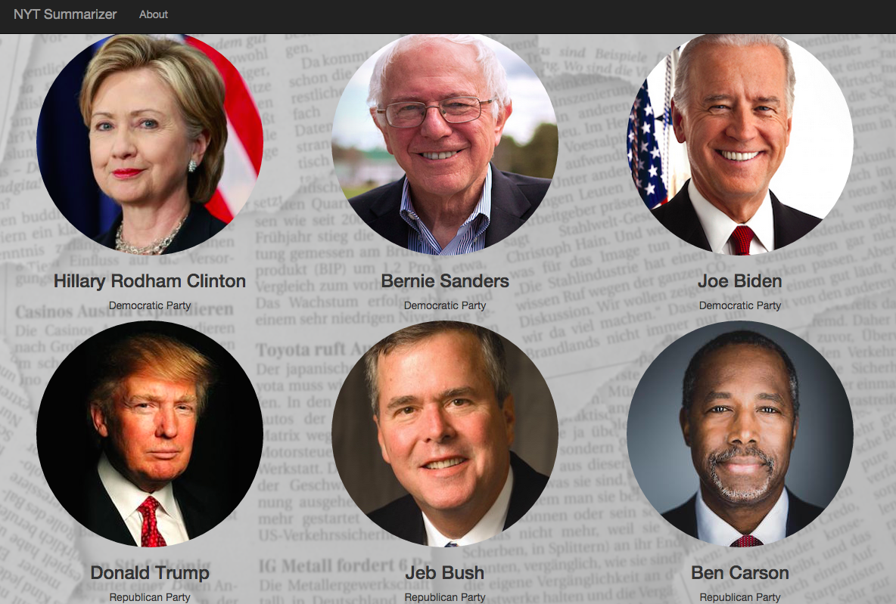

##NYT Summarizer: A New York Times Comments Summarizer on Presidential Candidates


<br>
<br>

<br>
<br>

## Overview

This project uses topic modeling and data visualization to explore user discussions and sentiments on the New York Times in regards to six current presidential candidates.

The goal is to find meaingful patterns in discussions about the candidates and detect how users feel towards various issues for individual candidates. For each candidate, I use sentiment analysis to classify positive and negative comments (about 25,000 comments per candidate) and topic modeling to discover issues about which users feel positive and negative towards the candidate.

My results capture the prevailing issues surrounding each candidate and showcase a typical comment for each positive and negative topic. This serves as a summarizer of the current discusssions and provides additional information on the comments' curation by New York times. 

http://nytsummarizer.us

<br>
<br>

<br>
<br>

<br>
<br>

<br>
<br>
 
## Process in detail
The main features of my modeling is sentiment classification and topic words.
For sentiment classification, I use Pattern, a Python package that takes in a piece of text and gives a sentiment score between -1 and 1 (most negative to most positive). I performed sentiment analysis on each comment in its entirety as well as at sentence level. In the end, I choose to use sentiment score at the sentence-level since it gives better signal than score on the entire comment, which tend to be very close to zero (neutral).

My analysis focuses on non-neutral comments and comments speficially discussed a particular candidate. I transform these comments into a corpus by tokenization and removal of stop words, and create tf-idf vectors. I use Non-negative Matrix Factorialization (NMF) for topic detection. This algorithm is chosen over alternatives such as LSA after comparing the results. NMF provides more distinct features (topic words) and more interpretable results.

How did you validate your results?

The visualization presents topics in recent news surrounding each candidate, and while comments vary, it is able to retrive a typical comment that captures the topic’s idea. Exploratory analyses show that the comments on the New York Times are highly curated and balanced. It is not a good dataset for (comment-to-candidate) classification problem as the signals (sentiment, relevancy) are muted.
many comments covers multiple candidates

## Repo Structure
```
.
├── App
|   ├── app.py
|   ├── static
|   └── templates
├── Data preparation
|   ├── web_scrape.py
|   └── mongodb_toDF.py
|   └── data_cleanup.py
|   └── utils.py
├── Modeling & Visualization
|   ├── topic_modeling.py
|   └── graphs.py

```


1. **`App`**: This directory contains the web application using Flask `app.py` , and templates of candidate's pages.
2. **`Data preparation`**: The `web_scrape.py` gets data from the New York Times Articles Search API and Community API (for user comments) and stores in MongoDB databases. `mongodb_toDF.py` transfers the data from the Mongodb databases to python in form of dataframes. The `data_cleanup.py` then prepares the data for modeling and analyses in which `utils.py` is used to accomplish major tasks such as removing non-essential characters, calculating sentiment scores, converting the date field, and parsing location data.
3. **`Modeling & Visualization`** has `topic_modeling.py`, which performs topic modeling on given data and output topic key words, example texts, and number of texts. `graphs.py` covers the visualization using plot.ly

## Future steps
I would like to re-visit the classification problem by more feature engineering. For example, using distinct topics associated with each candidate or other measures (subjectivity) to improve classification results.
Examine on what topics are the comments overlapping for candidates. Ex. plotting the the comments on two axises representing two topics.
More precise clustering that can be used for targeting. 

Last, combining both the comments and news cycles (articles) to predict emerging topics.
