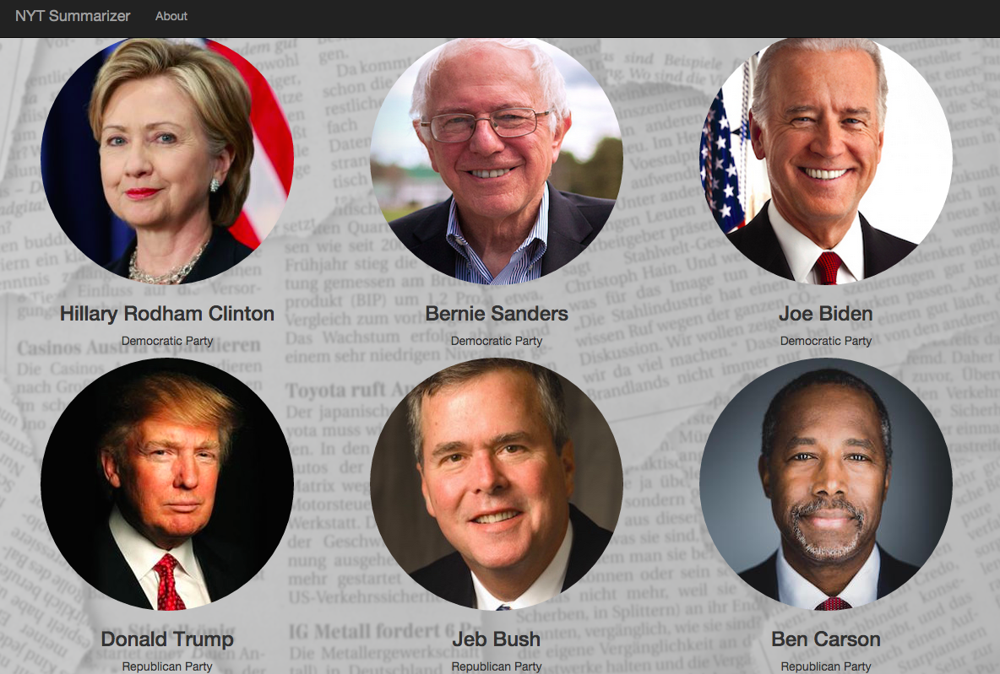
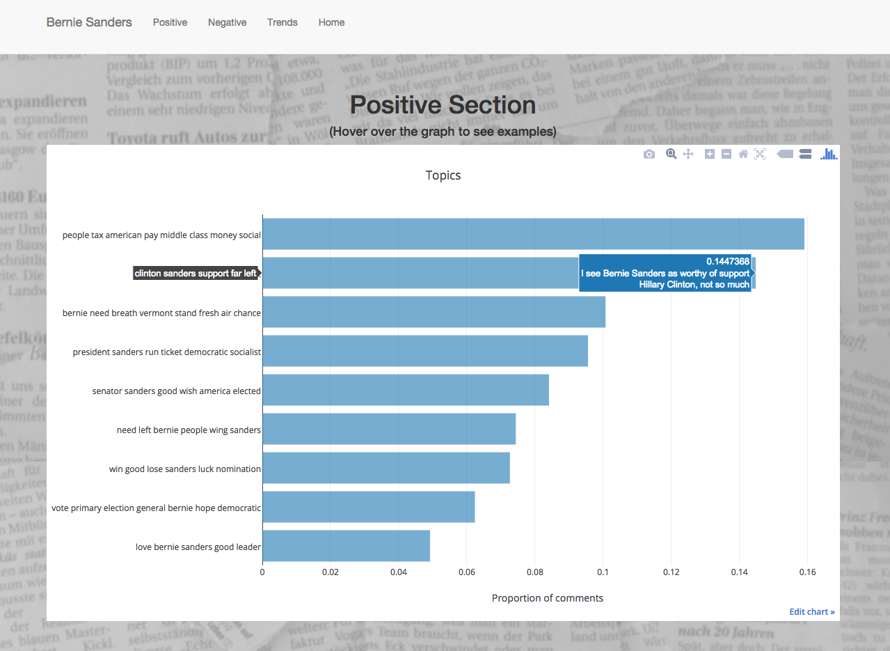
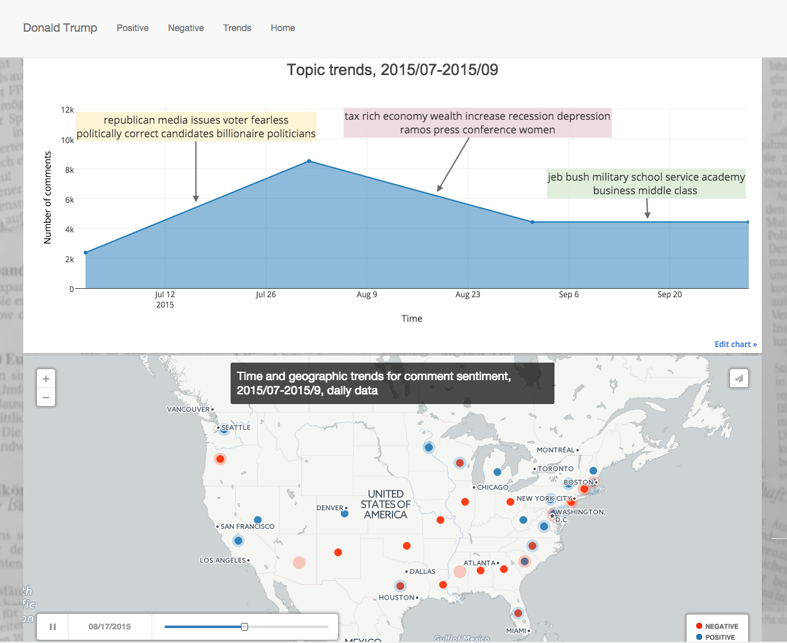

##NYT Summarizer: A New York Times Comments Summarizer on Presidential Candidates


<br>
<br>

<br>
<br>

## Overview

This project uses topic modeling and data visualization to explore user discussions and sentiments on the New York Times for six current presidential candidates.

- The goal is to find meaningful topics among the positive and negative comments about individual candidates.
- For each candidate, I use sentiment analysis to classify about 25,000 comments into positive and negative comments, and then perform topic modeling on these two sets of comments to discover what issues users feel positive and negative towards the candidate.

The visualization captures the prevailing issues surrounding each candidate and showcase a representative comment for each positive and negative topic. This serves as a summarizer of the current discusssions. In addition, it provides information on the geographic and sentiment distribution of all the comments in the dataset.

Explore [NYT Summarizer](http://nytsummarizer.us).

<br>
<br>

<br>
<br>

<br>
<br>

<br>
<br>
 
## Process in detail
- The main features of my project are topics and trends in the comments for each candidate.
- For sentiment classification, I use  **`Pattern`**, a Python package that takes in a piece of text and gives a sentiment score between -1 and 1 (most negative to most positive). I perform sentiment analysis on each comment (in its entirety) as well as at the sentence level. In the end, I choose to use sentiment score at the sentence-level since it gives better signal than score on the entire comment, which tends to be very close to zero (neutral).
- My analysis focuses on non-neutral comments and comments that speficially mentioned a particular candidate. I transform the  corpus into TF-IDF vectors by tokenization, and removal of stop words and other unwanted characters. I use Non-negative Matrix Factorialization (NMF) for topic detection. This algorithm is chosen over alternatives such as LSA after comparing the results. NMF provides more distinct features (topic words) that are also more interpretable.
- Validation is achieved by choosing the optimal number of topics. I accomplish it in two ways. First, I use PCA on the corpus to infer the number of components. Then I use gensim and perform latent dirichlet allocation (LDA) on the corpus for a range of numbers for the topics (5, 10, 15, 20, 25). For each trial, I calculate the perplexity on a held-out set, and also the Kullback-Leibler divergence (entropy) on the clusters. Across corpus for each candidate, the ideal number of topics falls between 5 and 10. In the case of equal level of perplexity or entropy, I use my own judgement on whether the topics make sense given the topic words.


## Insights
- The visualization captures topics about each candidate in recent news, and while comments vary, it gives a typical comment that represents the topic’s idea. 
- Exploratory analyses show that the comments on the New York Times are highly balanced in terms of sentiments and other measures. I will need more feature engineering for (comment-to-candidate) classification problem as the signals (sentiment, relevancy) are muted.
- As the results demonstrate, the conversations around presidential candadates are diffuse; that is, comments often mention mutiple candidates. This presents difficulty in creating distinct candidate clusters. Often times, it is easier to create issue clusters. 

**Detailed discussions on my analytical choices can be found on [my blog](http://www.peggyfan.wordpress.com).**

## Repo Structure
```
.
├── App
|   ├── app.py
|   ├── static
|   └── templates
├── Data preparation
|   ├── web_scrape.py
|   └── mongodb_toDF.py
|   └── data_cleanup.py
|   └── utils.py
├── Modeling & Visualization
|   ├── topic_modeling.py
|   └── similarity.py
|   └── graphs.py
├── Validation
|   └── model_comparison.py


```

1. **`App`**: This directory contains the web application using Flask `app.py` , and templates and CSS files of candidates' pages.
2. **`Data preparation`**: The `web_scrape.py` gets data from the New York Times Articles Search API and Community API (for user comments) and stores in MongoDB databases. `mongodb_toDF.py` transfers the data from the Mongodb databases to python in form of pandas dataframes. The `data_cleanup.py` then prepares the data for modeling and analyses, in which `utils.py` is used to accomplish major tasks such as removing non-essential characters, calculating sentiment scores, converting date field, and parsing location data.
3. **`Modeling & Visualization`** has `topic_modeling.py`, which performs topic modeling on given data and output topic key words, example texts, and number of texts.`similarities.py` calculates the similarity between each comment and its respective article to provide a measure of relevance. It was originally developed as a feature in building a candidate classifier. It then is used to demonstrate overall data patterns. `graphs.py` covers the visualization using plot.ly and cartoDB.
4. `model_comparison.py` includes validation results using PCA and LDA.

## Future steps
- Re-visit the classification problem by doing more feature engineering. For example, using distinct topics associated with each candidate or other measures (subjectivity) to improve classification results.
- Get more precise clustering by examining on what topics are the comments overlapping for candidates. For instance, plotting the comments on two axises each representing a topic.
- Collect data for longer period of time and combine both the comments and news cycles (articles) to predict emerging topics.

## Tools used
- MongoDB, pymongo
- NYT Article Search & Community API
- BeautifulSoup
- NumPy, SciPy, scikit-learn, Pandas
- NLTK
- gensim 
- Plot.ly, CartoDB
